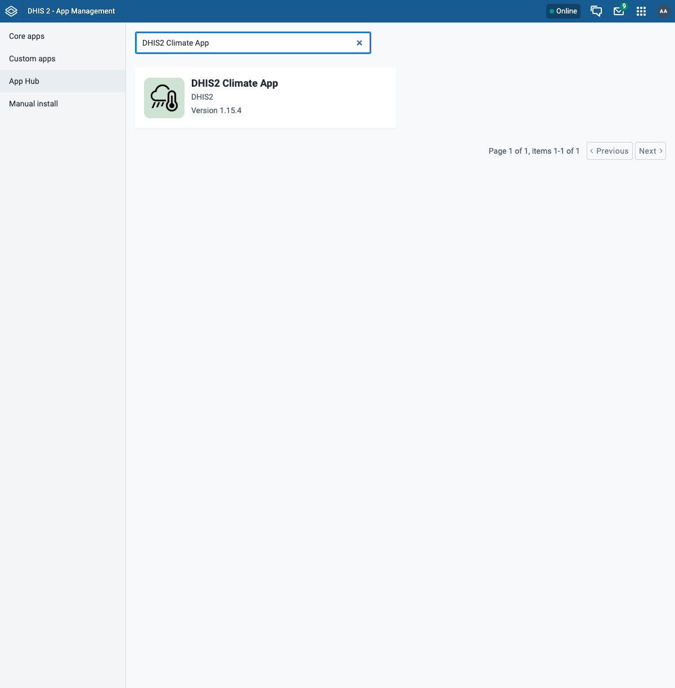
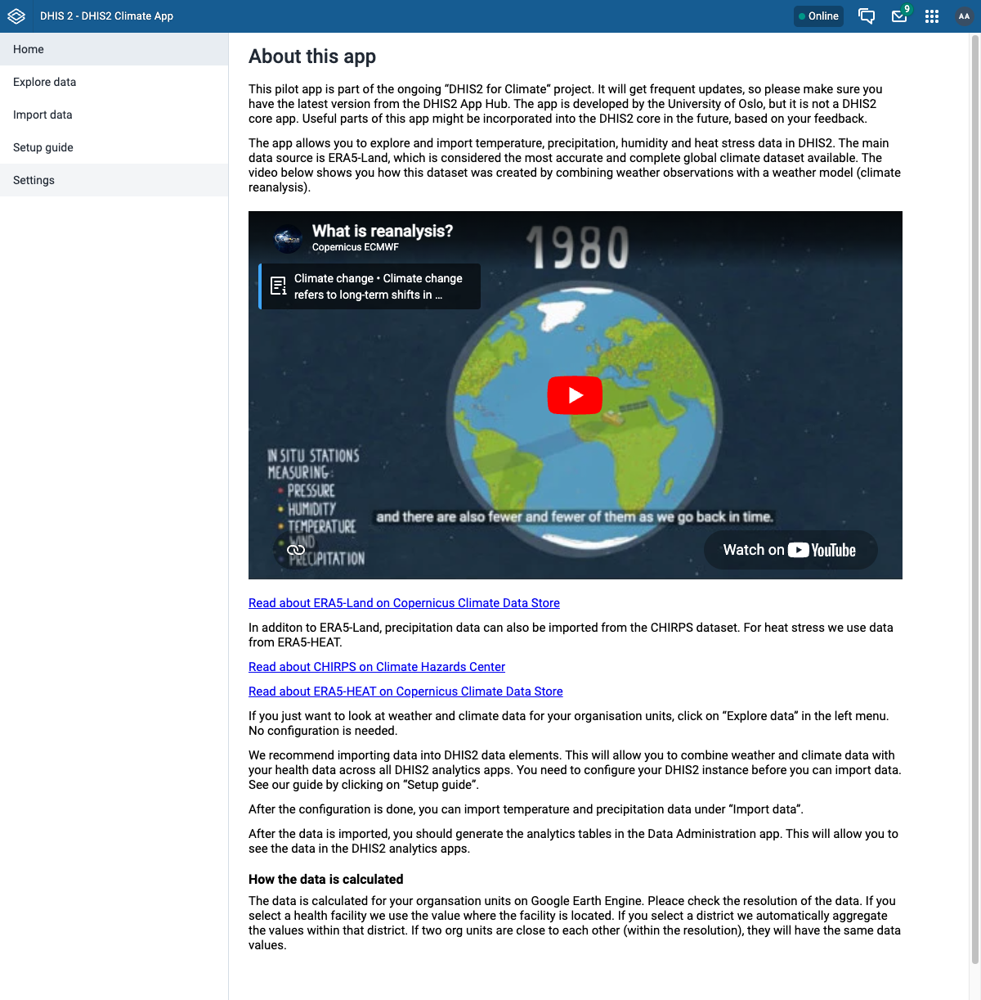
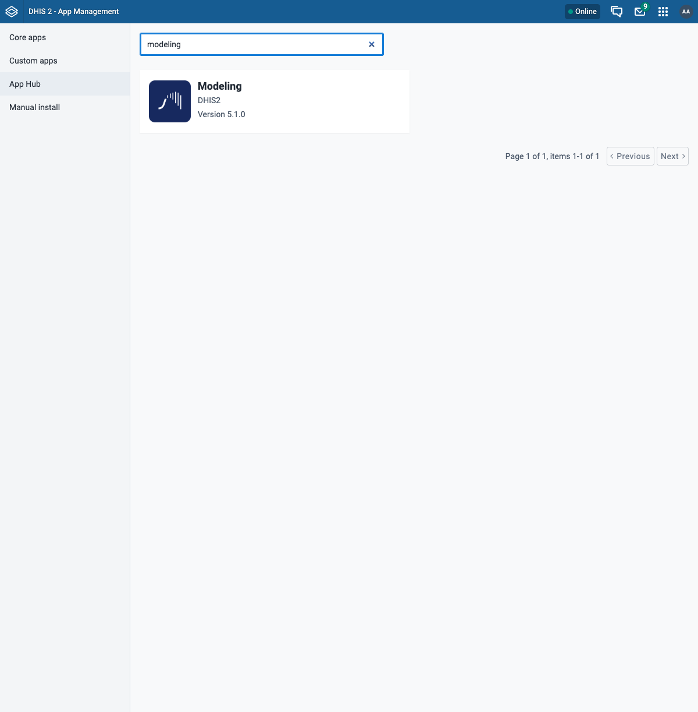
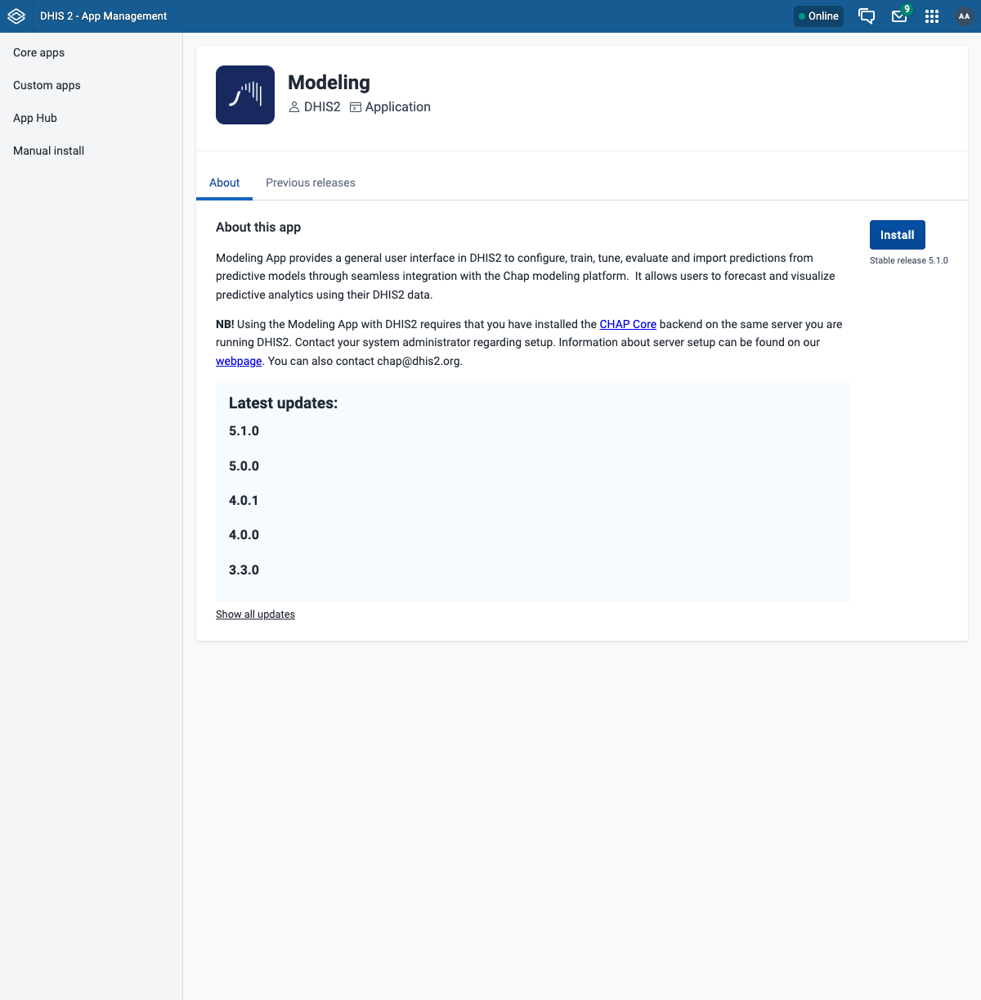
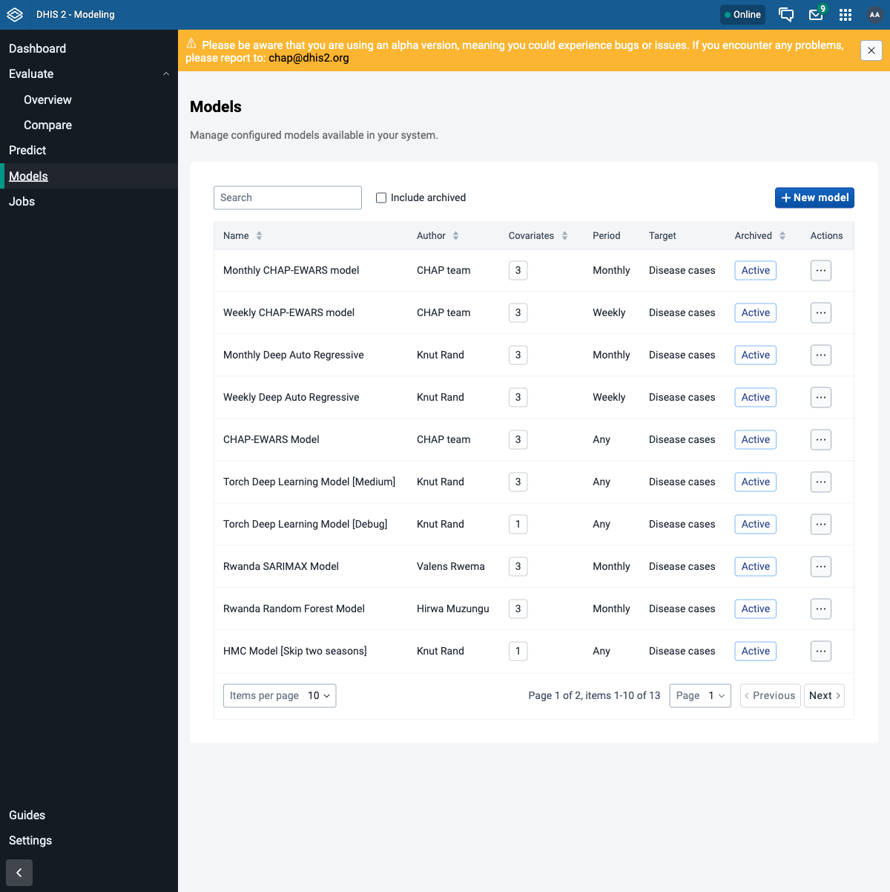

# Install the DHIS2 apps

The climate track uses two DHIS2 apps, both installed from the **App Hub** inside DHIS2 - no
command line needed:

- **DHIS2 Climate App** - explore and import weather and climate data. It only needs DHIS2, so
  you can install it any time. We install it here mostly to show what it offers.
- **Modelling App** - configure, train, evaluate, and import predictions from CHAP models.
  This is the app you will use the most, and it **needs chap-core connected** (the previous
  guides).

!!! note "Before you start"
    DHIS2 is running, and chap-core is connected with the route healthy - whichever way you ran
    it ([bundled](add-chap-core.md) or [from a clone](chap-core-from-source.md)). The Climate
    App works with DHIS2 alone; the Modelling App needs the chap-core connection.

## Step 1 - Open the App Hub

In DHIS2, open the **apps menu** (top-right grid icon) and go to **App Management**. In the
left menu choose **App Hub**. This is the catalogue of apps you can install with one click.

## Step 2 - Install the Climate App

Search for **DHIS2 Climate App** (searching just "climate" also returns an unrelated app, so
use the full name) and open it.



Click **Install**. When it finishes, open it from the apps menu - it lets you explore and
import ERA5 climate data for your organisation units.



The Climate App talks only to DHIS2, so it works even without CHAP. We will not use it heavily
in this track, but it is worth knowing it exists.

## Step 3 - Install the Modelling App

Back in **App Hub**, search for **modeling** and open the **Modeling** app.



Click **Install** (stable release). Notice the app's own note: it **requires the CHAP Core
backend** on the same server - which is exactly what you set up in the previous guides.



!!! info "The Modelling App needs an authority"
    The app requires the `F_CHAP_MODELING_APP` authority. The `admin` user already has it. To
    let other users open the app, add that authority to their user role in the **Users** app.

## Step 4 - Confirm the Modelling App reaches CHAP

Open the **Modeling** app from the apps menu and go to **Models** in the left menu. If the app
can reach CHAP through the route, you will see a list of configured models (CHAP-EWARS and
others) loaded straight from chap-core:



!!! note "Assignment: apps installed and connected"
    - [ ] The **Climate App** opens and loads.
    - [ ] The **Modelling App** opens, and its **Models** page lists models (e.g. CHAP-EWARS).

    If the Models page is empty or shows a connection error, the app cannot reach CHAP - go
    back to [Run chap-core](add-chap-core.md) and confirm `…/api/routes/chap/run/health`
    returns healthy.

## Troubleshooting

| Symptom | Likely cause / fix |
|---------|--------------------|
| Modelling App shows no models or a connection error | CHAP is not reachable through the route. Re-check the route health (see [Run chap-core](add-chap-core.md)). |
| Modelling App is missing from the apps menu | Install did not complete, or your user lacks `F_CHAP_MODELING_APP`. Re-install and check the user role. |
| App Hub list is empty | DHIS2 cannot reach the central App Hub. Check the machine's internet connection. |

## Advanced: installing an app with curl

The App Hub install is just an API call, so you can script it - useful for reproducible setups
or headless servers. Find the app's latest version id, then `POST` to it:

```bash
# Find the latest version id for an app by name (e.g. "Modeling")
VERSION_ID=$(curl -s -u admin:district "http://localhost:8080/api/appHub" \
  | jq -r '.[] | select(.name=="Modeling") | .versions[0].id')

# Install that version
curl -s -u admin:district -X POST "http://localhost:8080/api/appHub/$VERSION_ID" -w '\nHTTP %{http_code}\n'
```

A `201` means it installed. This is exactly what the **Install** button does under the hood -
for normal use, prefer the UI.

## What's next

DHIS2, CHAP, and the apps are all in place. From here the climate track moves on to using the
Modelling App - running a backtest (evaluation), making a prediction, and configuring models.
