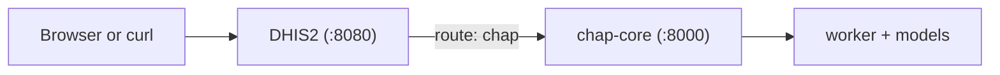

# DAC Climate and Health

Build a local **DHIS2 + CHAP** environment, run an evaluation and prediction, then inspect
and extend the workflow. The core path has a single choice that does not change the rest: use
released CHAP images for the quickest setup, or build CHAP from source. The **modeller track**
(step 8, building your own model) needs the source setup.

## Follow the workshop

-   :material-laptop:{ .lg .middle } &nbsp;__1. Prepare your machine__

    ---

    Install Docker, Git, and the small command-line tools used in the exercises.

    [:octicons-arrow-right-24: Prepare](getting-started/prerequisites.md)

-   :material-docker:{ .lg .middle } &nbsp;__2. Docker basics__

    ---

    A quick primer: build and run one container, then a two-service stack with Compose.

    [:octicons-arrow-right-24: Learn the basics](getting-started/docker-intro.md)

-   :material-database:{ .lg .middle } &nbsp;__3. Start DHIS2__

    ---

    Run the Laos climate demo database and confirm that you can log in.

    [:octicons-arrow-right-24: Start DHIS2](getting-started/start-dhis2.md)

-   :material-link-variant:{ .lg .middle } &nbsp;__4. Connect CHAP__

    ---

    Choose the bundled or source setup and verify the DHIS2 route to CHAP.

    [:octicons-arrow-right-24: Connect CHAP](getting-started/chap-setup.md)

-   :material-apps:{ .lg .middle } &nbsp;__5. Install the apps__

    ---

    Add the Climate App and Modelling App from the DHIS2 App Hub.

    [:octicons-arrow-right-24: Install apps](getting-started/install-apps.md)

-   :material-chart-line:{ .lg .middle } &nbsp;__6. Evaluate and predict__

    ---

    Run one shared Laos demo scenario in the app or through the API.

    [:octicons-arrow-right-24: Evaluate](modelling/index.md)

-   :material-tune:{ .lg .middle } &nbsp;__7. Configure a model__

    ---

    Create an EWARS variant and run it with the same workflow.

    [:octicons-arrow-right-24: Configure](modelling/configured-models-ui.md)

-   :material-hammer-wrench:{ .lg .middle } &nbsp;__8. Build a model__

    ---

    Scaffold your own CHAP model with chapkit and register it. Needs the source setup.

    [:octicons-arrow-right-24: Build](modelling/chapkit-scaffold.md)

Each step starts with its prerequisites and ends with a link to the next step. Assignment
boxes mark the checks that should pass before you move on.

## Jump to a task

| I need to... | Go to |
|--------------|-------|
| Complete the workshop with the fewest setup steps | [Quick CHAP setup](getting-started/add-chap-core.md) |
| Build or change chap-core locally | [CHAP development setup](getting-started/chap-core-from-source.md) |
| Run a model by clicking through the app | [Evaluate and predict in the UI](modelling/with-ui.md) |
| Script a model run | [Evaluate and predict through the API](modelling/with-curl.md) |
| Understand a failed or slow job | [Find and diagnose failures](operations/logs.md) |
| Inspect what a run stored | [Inspect the databases](operations/database.md) |
| Protect data before a change | [Back up and restore](operations/backup-restore.md) |
| Upgrade CHAP or roll it back | [Upgrade or roll back CHAP](operations/upgrading.md) |

## What you are building

| Piece | Role | Where you use it |
|-------|------|------------------|
| **DHIS2** | Health information platform with the Laos climate demo data. | `http://localhost:8080` |
| **CHAP** | Modelling engine that evaluates models and produces forecasts. | Through the DHIS2 `chap` route |
| **Modelling App** | DHIS2 interface for configuring and running CHAP models. | Inside DHIS2 |

The Modelling App and API exercises use the same route, model, data mapping, periods, and
organisation units. Those shared values live in one place:
[Workflow and demo data](modelling/index.md).
