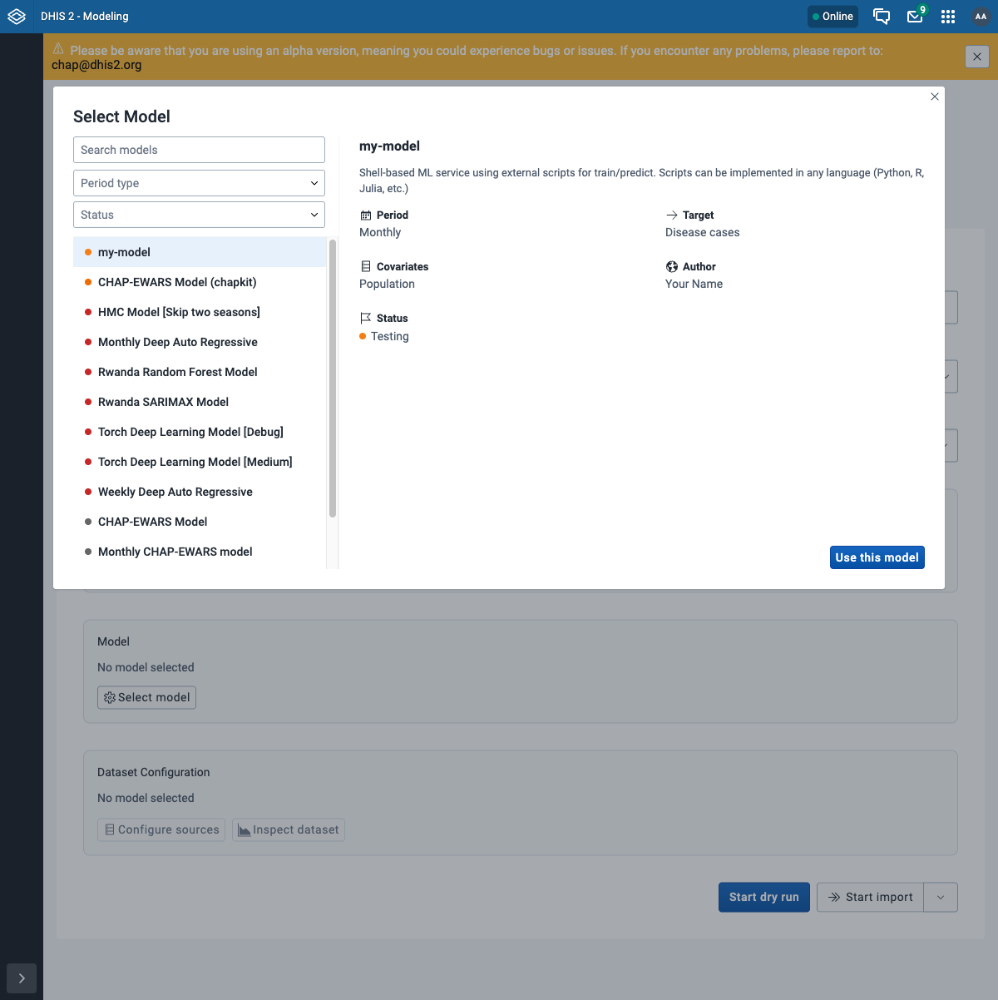
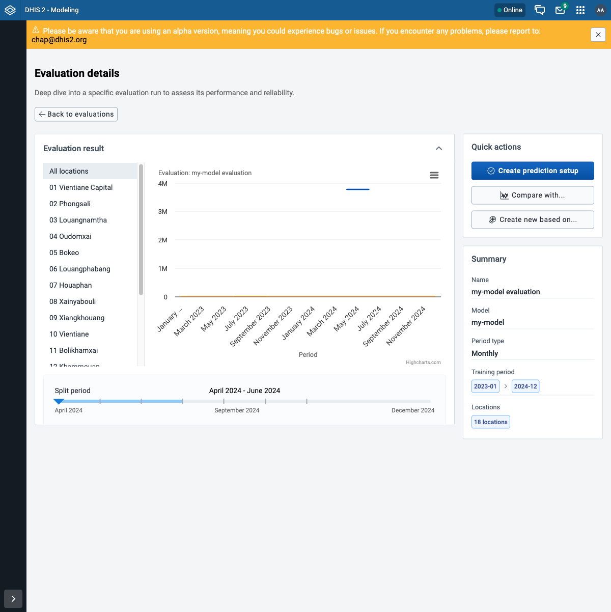

# Register your model with CHAP

This is step 7b. Your [scaffolded model](chapkit-scaffold.md) runs and passes `chapkit test` on
its own. Now you connect it to chap-core: a chapkit model **self-registers** with chap when you
point it at chap's registration endpoint. Once registered, it appears in chap-core's model list
and in the Modelling App exactly like the built-in models, so the
[evaluation](with-curl.md) / prediction / [configure](configured-models-curl.md) flows all work
on it unchanged.

!!! note "Before you start"
    Run chap from the **[Development setup (source)](../getting-started/chap-core-from-source.md)**
    (the `chap-core` repo). You attach your model as a compose overlay on chap's own network, so
    chap can reach it by name - which the bundled image stack is not set up for. Your model
    project from [step 7a](chapkit-scaffold.md) should sit next to the `chap-core` folder.

## Step 1 - How registration works

The scaffolded `main.py` ends with `.with_registration()`. That call does nothing until the env
var **`SERVICEKIT_ORCHESTRATOR_URL`** is set to chap's register endpoint. When it is, the
service registers itself on startup and pings periodically to stay alive. chap then **syncs it
into its model list** - it shows up as a model template (flagged `usesChapkit`) and chap seeds a
ready-to-run configured model from it. chapkit's
[Deploying to chap-core](https://dhis2-chap.github.io/chapkit/guides/deploying-to-chap-core/)
guide documents this registration flow in full.

## Step 2 - Add a compose overlay onto chap-core

In the **`chap-core`** folder, create `compose.my-model.yml` - the same pattern chap uses for
EWARS (`compose.ewars.yml`):

```yaml
services:
  my-model:
    build: ../my-model          # path to your scaffolded project
    # or, to use a published image instead of building:
    # image: ghcr.io/your-org/my-model:latest
    environment:
      # $$ escapes the $ for Docker Compose
      SERVICEKIT_ORCHESTRATOR_URL: http://chap:8000/v2/services/$$register
    depends_on:
      chap:
        condition: service_healthy
```

The service name (`my-model`) is how chap reaches it on the shared network - no host addresses
or ports to configure.

!!! note "If your chap requires a registration key"
    A chap server can lock down registration by setting `SERVICEKIT_REGISTRATION_KEY`; the model
    must then send the matching key (the EWARS overlay has a commented `SERVICEKIT_REGISTRATION_KEY`
    line for this). The from-source dev stack in these guides does **not** set it, so you can
    leave it out.

## Step 3 - Bring it up alongside chap

Layer your overlay onto the from-source stack:

```bash
docker compose -f compose.yml -f compose.chapkit.yml -f compose.my-model.yml up -d --build
```

Your model builds, starts, and registers within a few seconds.

## Step 4 - Verify it registered

Through the DHIS2 route (auth at DHIS2, as everywhere else):

```bash
export CHAP="http://localhost:8080/api/routes/chap/run"
export AUTH="admin:district"

# the live chapkit services
curl -fsS -u "$AUTH" "$CHAP/v2/services" | jq -r '.services[].id'
# your model as a model template, flagged as chapkit
curl -fsS -u "$AUTH" "$CHAP/v1/crud/model-templates" \
  | jq -r '.[] | select(.name=="my-model") | "\(.name)  usesChapkit=\(.usesChapkit)"'
# the configured model chap seeded from it
curl -fsS -u "$AUTH" "$CHAP/v1/crud/configured-models" \
  | jq -r '.[] | select(.name=="my-model") | "\(.id)\t\(.displayName)"'
```

In the **Modelling App** it now appears in the model picker (Evaluate → New evaluation → Select
model), right next to CHAP-EWARS - with the metadata from your `MLServiceInfo`:



## Step 5 - Run it like any other model

From here, nothing is special: evaluate or predict with it exactly as in the
[API walkthrough](with-curl.md) (or in the app), setting the `modelId` to your model's name. The
result opens like any other - here the example model's flat line is its naive "predict the
historical mean" forecast against the actual cases:



!!! tip "Give the backtest a covariate"
    A backtest predicts the target from **future covariate** values, so your model must declare
    at least one covariate (`required_covariates=["population"]` in `MLServiceInfo`) and the data
    must supply it - with only the target there is nothing to predict from. The scaffold's
    example model also just averages its numeric inputs, so expect meaningless metrics until you
    put real logic in the scripts. That contrast is the point: swap in your model and the same
    flow scores it.

!!! note "Sharing and lifecycle"
    - **Share it:** publish the image to a registry and use `image:` instead of `build:` in the
      overlay (the EWARS overlay does this). R models pull from
      [chapkit-images](https://github.com/dhis2-chap/chapkit-images).
    - **Deregistration:** if the service stops pinging, chap archives its template after the TTL
      - past runs still resolve, but it drops out of the model picker.

!!! note "Assignment: your model in CHAP"
    - [ ] Add the overlay and bring the stack up; confirm `/v2/services` lists your model.
    - [ ] Confirm it shows as a `usesChapkit` template and appears in the Modelling App picker.
    - [ ] Run an evaluation against it (with a covariate) and watch the job reach `SUCCESS`.

## What's next

You have taken a model from `chapkit init` to running inside CHAP and DHIS2. That completes the
build-a-model track; from here you can iterate on the scripts, publish an image, and share it.
