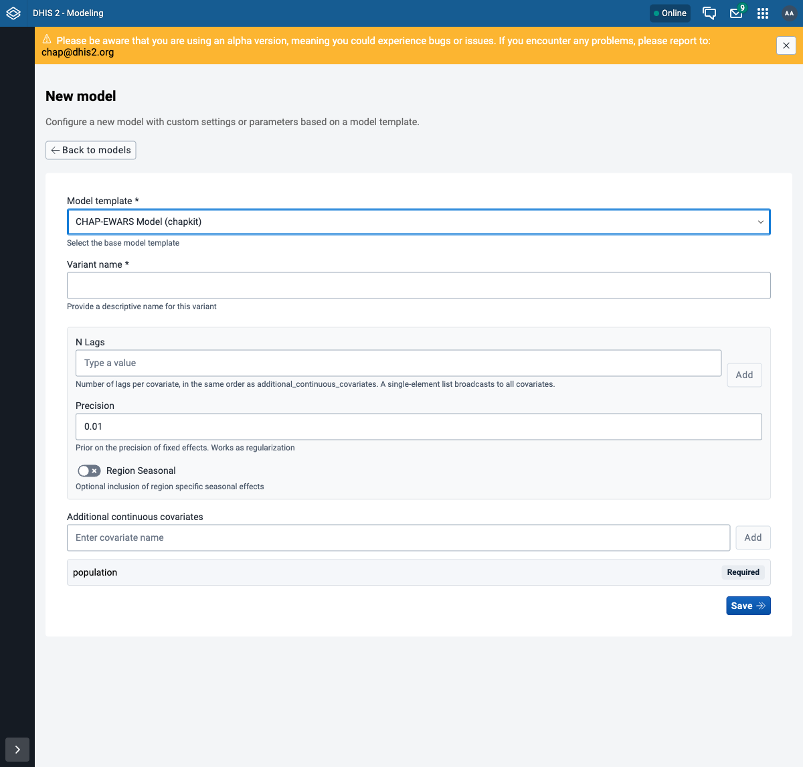
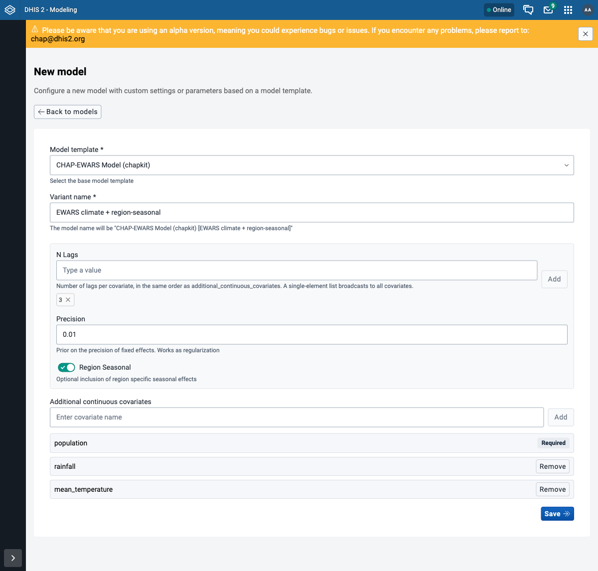

# Configure a model in the Modelling App

This is step 7 of the workshop. A **configured model** is a **model template** plus a chosen set
of **options** - a ready-to-run variant. The stock models you used earlier (like *CHAP-EWARS
Model (chapkit)*) are configured models; here you build your own variant in the Modelling App's
**New model** form. The [API version](configured-models-curl.md) does exactly the same over curl.

We will build a variant of the chapkit EWARS model that turns on **region-specific seasonal
effects** and uses the climate covariates.

!!! note "Before you start"
    DHIS2 + chap-core are running and connected, and the **Modelling App** is installed
    ([step 5: install the apps](../getting-started/install-apps.md)). You have worked through
    [evaluate and predict](index.md) (step 6), so the run flow is familiar.

## Step 1 - Open the New model form

In the **Modeling** app, open **Models** in the left menu and click **New model**.

## Step 2 - Pick a model template

From **Model template**, choose **CHAP-EWARS Model (chapkit)**. The form then shows exactly what
that template lets you set - its options (**N Lags**, **Precision**, **Region Seasonal**) and its
required covariate (**population**, already listed and marked *Required*). This is the same
template and options the [API version](configured-models-curl.md) inspects with curl.

## Step 3 - Fill in the variant

Match the variant from the API version:

- **Variant name:** `EWARS climate + region-seasonal` - the helper text under the field previews
  the full model name it will get.
- **N Lags:** type `3` and click **Add** (a `3` chip appears).
- **Precision:** leave the default `0.01`.
- **Region Seasonal:** turn the toggle **on**.
- **Additional continuous covariates:** add `rainfall` and `mean_temperature` (type each, then
  **Add**); `population` is already there, marked **Required**.

!!! warning "N Lags is required"
    Saving with **N Lags** empty is rejected with a "Required" error - even though the field has
    no asterisk like **Variant name** does. Add a value (here `3`) before you save.

## Step 4 - Save and use it

Click **Save**. The variant appears in the **Models** list as *CHAP-EWARS Model (chapkit) [Ewars
climate + region-seasonal]*, alongside the stock models, and is usable straight away. Run it
however you ran [step 6](index.md): it shows up in the model picker (Evaluate -> New evaluation ->
Select model) under its display name - pick it and evaluate or predict with it exactly as before.

!!! note "Saving is idempotent"
    Saving the same variant again returns the **existing** model (same id) rather than creating a
    duplicate, so it is safe to repeat.

!!! note "Where the predictions land"
    This variant targets **disease cases** (dengue), so its forecasts import into the existing
    `CHAP Dengue Cases (Any) - Weekly Quantile …` data elements - the same outputs the stock model
    uses. A model with a **different target** would need its own output data elements in DHIS2
    first.

!!! note "Assignment: configure your own model"
    - [ ] Open **New model**, pick the **CHAP-EWARS Model (chapkit)** template, and create a
      variant with **Region Seasonal** on and the climate covariates.
    - [ ] Confirm it appears in the **Models** list (and in the Evaluate model picker).
    - [ ] Run an evaluation with it.

## Where to go next

You have completed the main workshop path. Run the custom variant with the
[shared demo workflow](index.md), or jump to the [reference guides](../index.md#jump-to-a-task) to
diagnose jobs, inspect stored results, back up data, or upgrade CHAP. To script the same
configuration, see the [API version](configured-models-curl.md).
