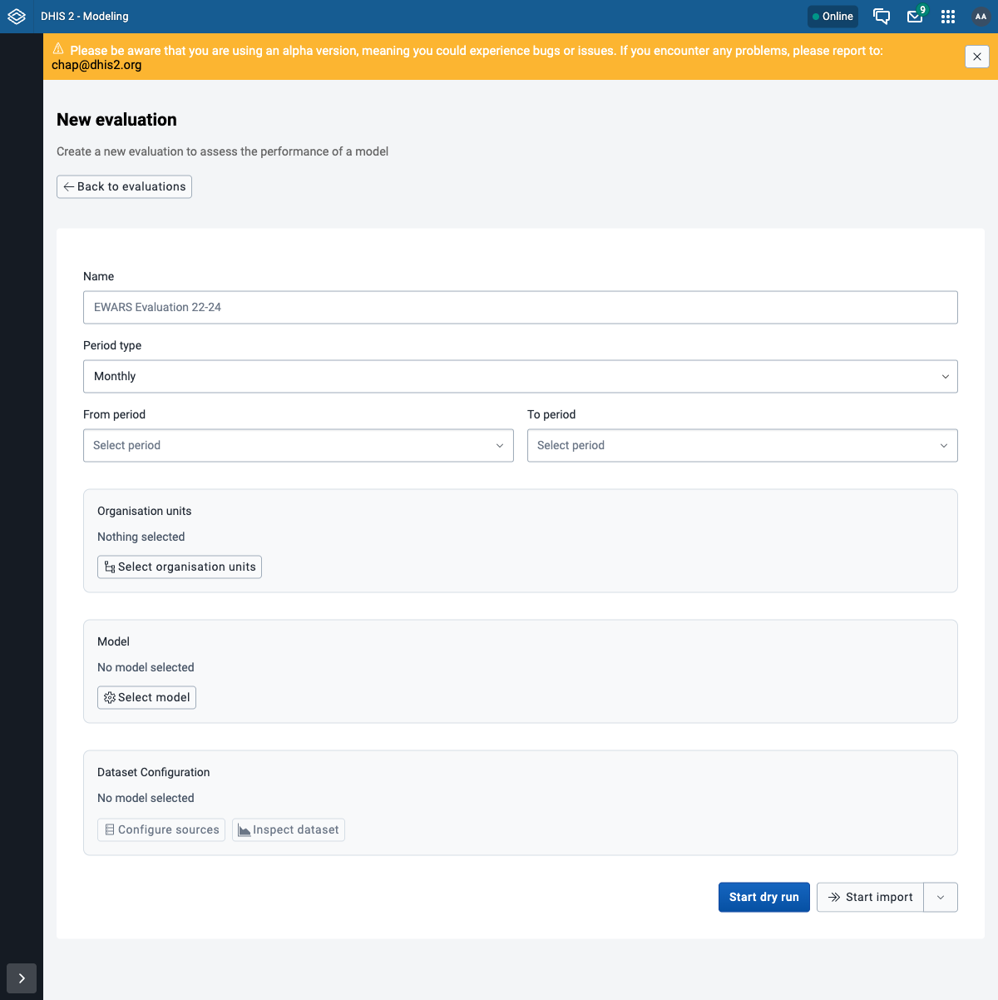
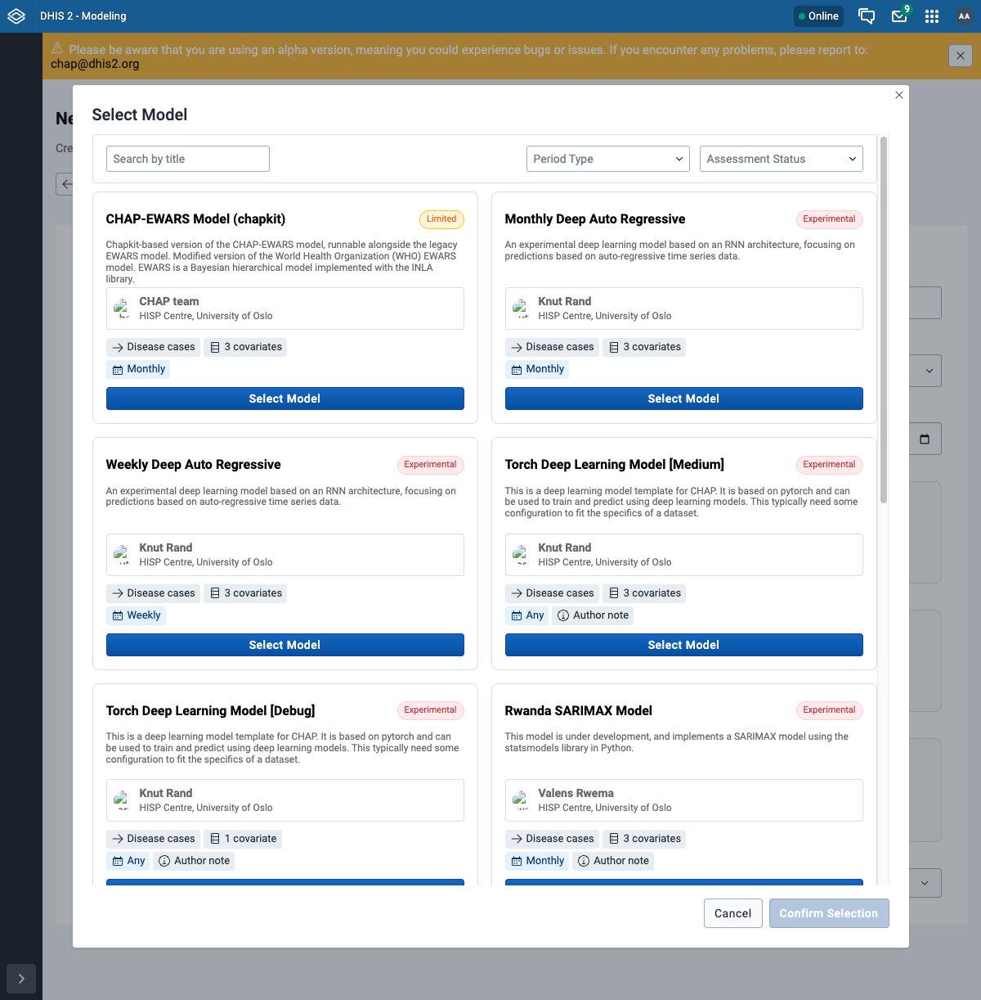
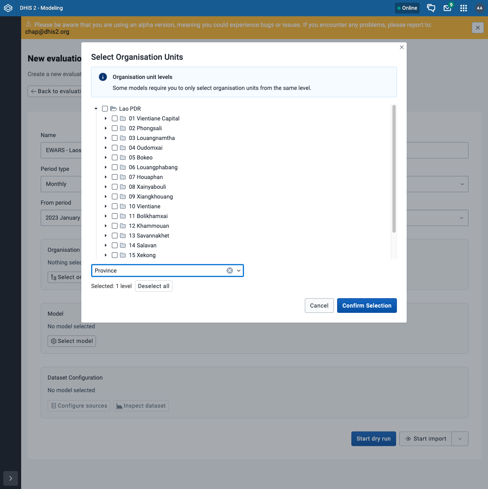
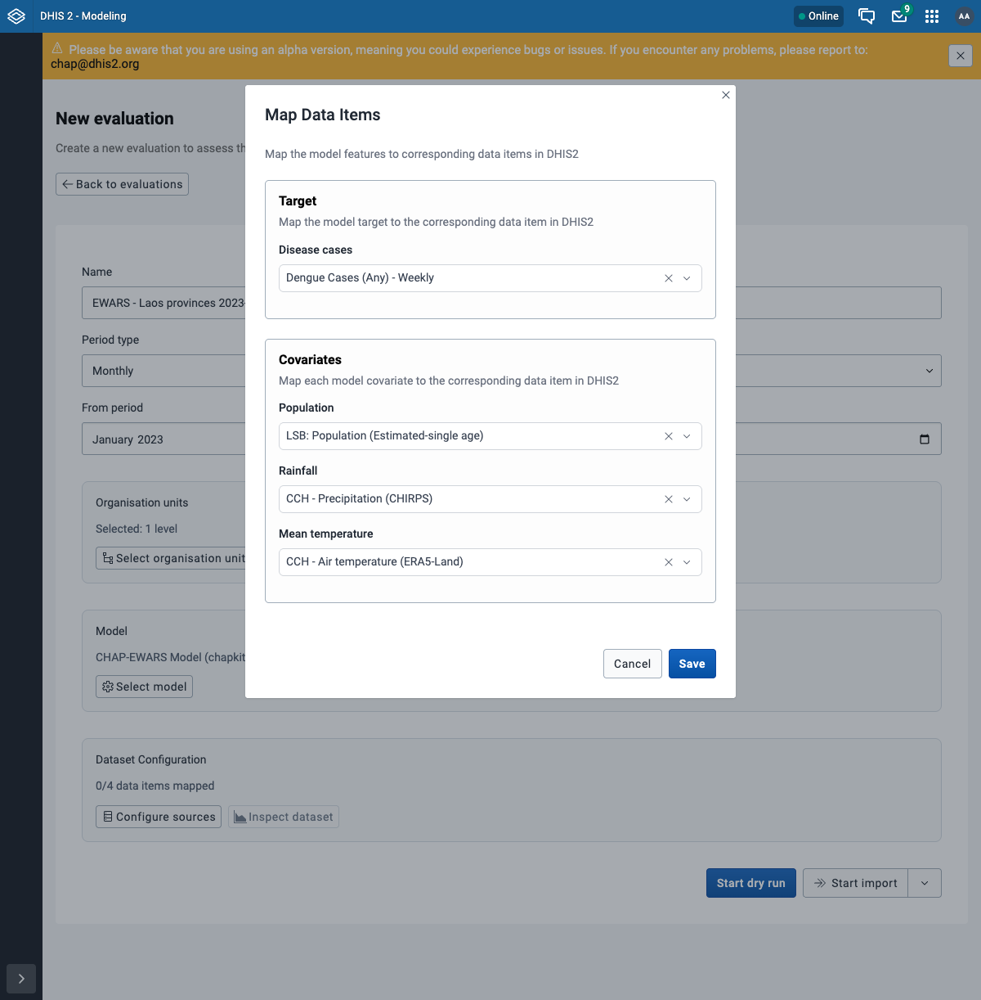
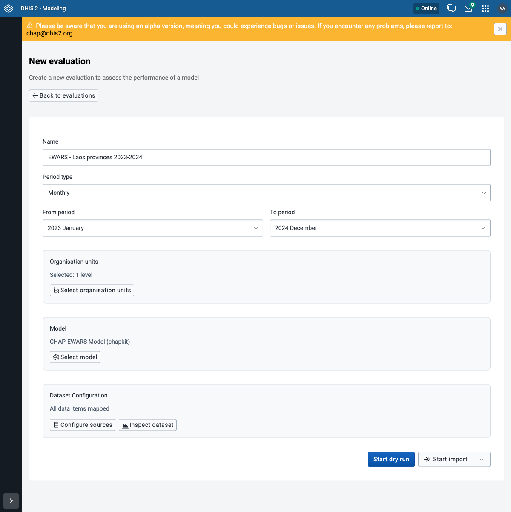
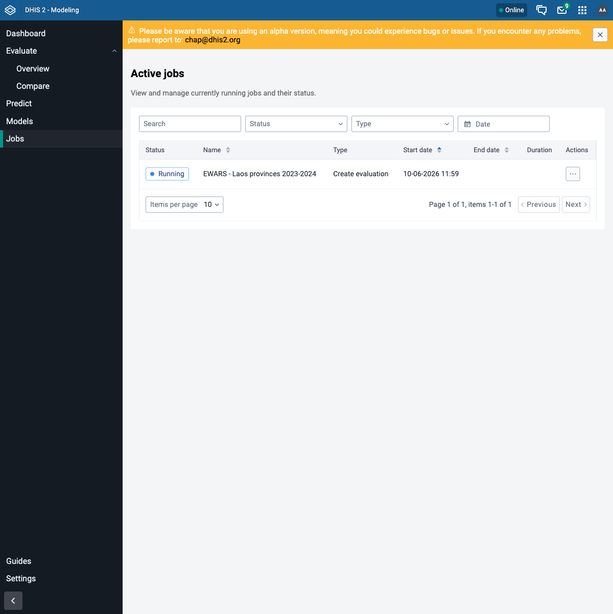
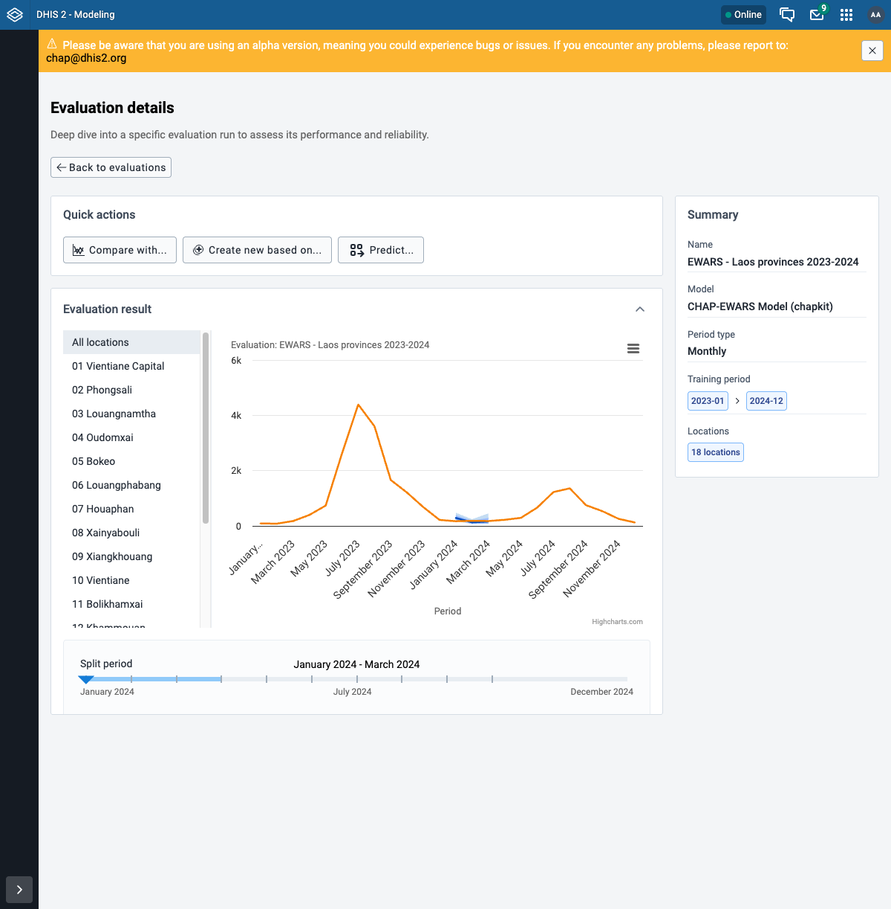
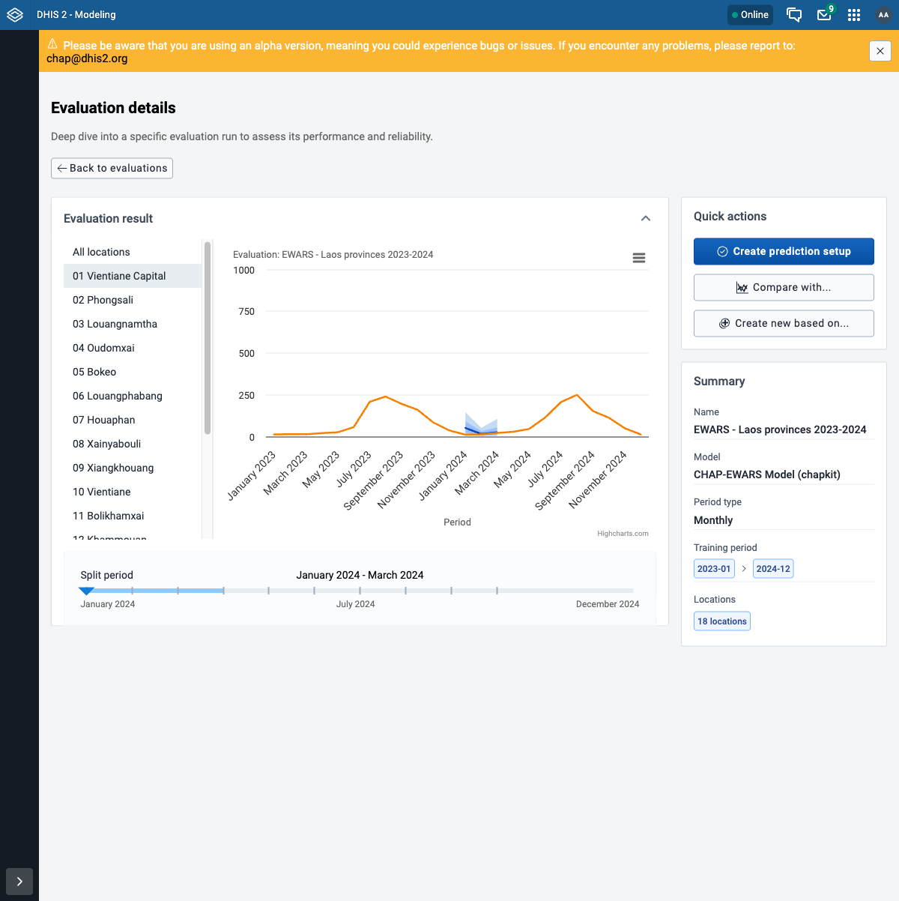
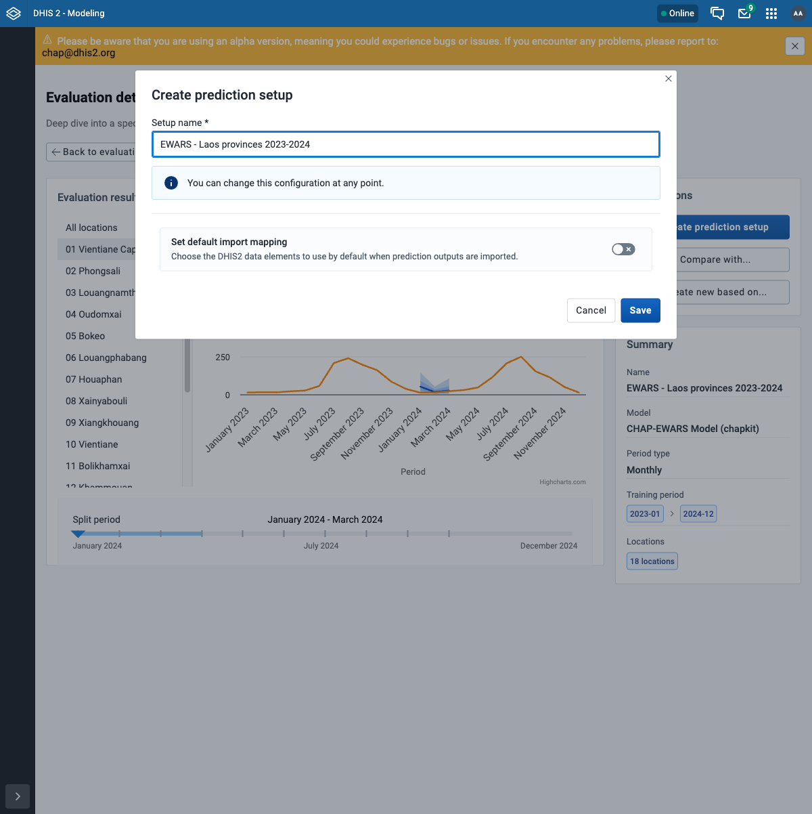
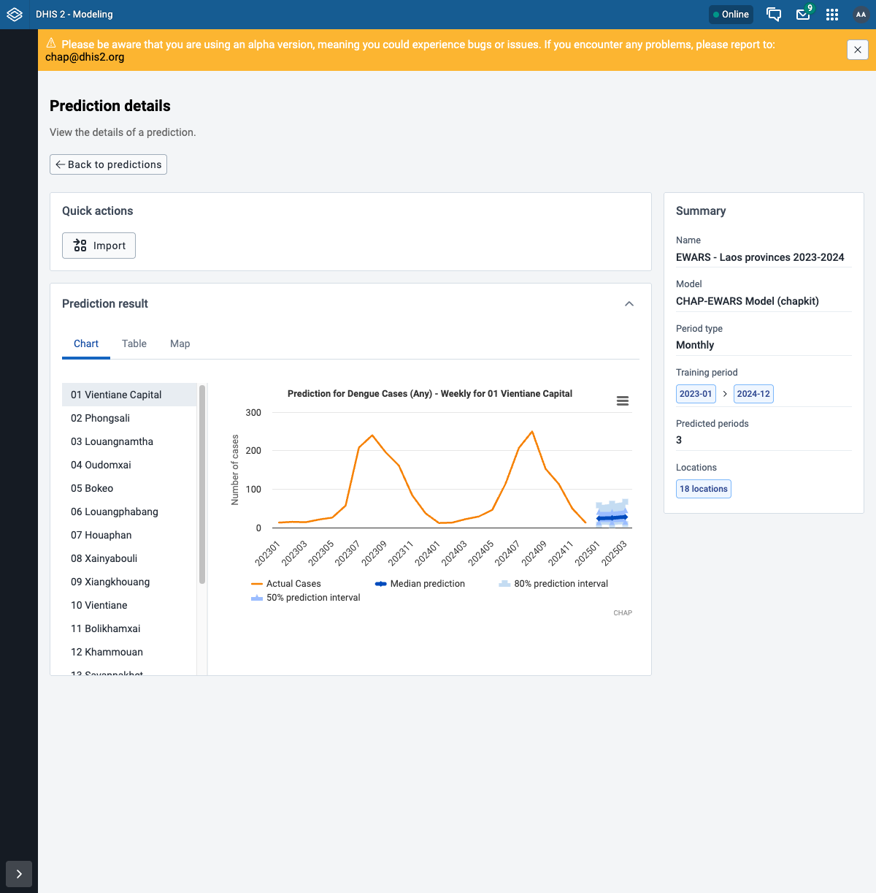

# Evaluate and predict in the Modelling App

This walks through an **evaluation (backtest)** and then a **prediction** in the Modelling
App, using the [shared configuration](index.md). Open the **Modeling** app from the DHIS2 apps
menu to begin.

## Part 1 - Evaluate (backtest)

An evaluation runs the model over historical periods and compares its predictions to what
actually happened.

### Step 1 - New evaluation

Go to **Evaluate -> Overview** and click **New evaluation**. You get a form with all the
settings for a run.

### Step 2 - Name and period

- **Name:** `EWARS - Laos provinces 2023-2024`
- **Period type:** Monthly
- **From period:** `2023-01`  **To period:** `2024-12`

### Step 3 - Select the model

Click **Select model** and choose **CHAP-EWARS Model (chapkit)**, then **Confirm Selection**.

### Step 4 - Select organisation units

Click **Select organisation units**. In the level dropdown choose **Province** - this selects
all 18 provinces at once - then **Confirm Selection**.

### Step 5 - Map the data

The model needs to know which DHIS2 data items feed its features. Click **Configure sources**
and map each one (see the [shared configuration](index.md) for the exact items):

| Model feature | DHIS2 data item |
|---|---|
| Disease cases | Dengue Cases (Any) - Weekly |
| Population | LSB: Population (Estimated-single age) |
| Rainfall | CCH - Precipitation (CHIRPS) |
| Mean temperature | CCH - Air temperature (ERA5-Land) |

Click **Save**. The form now shows **All data items mapped**.

### Step 6 - Start the run

Your form should look like this. Click **Start import**.

!!! tip "Dry run vs import"
    **Start import** runs the evaluation and stores the result. **Start dry run** is a quick
    check that the data and config are valid without storing a full run.

### Step 7 - Watch the job

You are taken to **Jobs**, where the run appears as **Running**. The EWARS model (INLA) takes a
couple of minutes over 18 provinces.

### Step 8 - View the results

When the job finishes, open it from **Evaluate**. The chart compares the model's predictions to
the actual disease cases; use the location list to look at one province at a time, and the
**Summary** panel shows the model, training period, and locations.

=== "All locations"
    

=== "One province"
    

!!! note "Assignment: run an evaluation"
    - [ ] Create the evaluation with the configuration above.
    - [ ] The job reaches **SUCCESS** on the Jobs page.
    - [ ] Open the result and confirm the chart shows predictions against actual cases.

## Part 2 - Predict

A prediction uses the same setup but **forecasts the future** instead of scoring the past.

### Step 1 - Start a prediction from the evaluation

On the evaluation's result page, under **Quick actions**, click **Predict...** and confirm
**Continue**. This opens a prediction form pre-filled with the same model, organisation units,
and data mapping.

### Step 2 - Name and run

Give it a name (`EWARS - Laos provinces 2023-2024`) and click **Start import**. Everything else
is already set from the evaluation.

### Step 3 - Watch the job

As before, the run shows up under **Jobs**. A prediction is quicker than a backtest - it only
forecasts forward.

### Step 4 - View the forecast

Open the prediction from **Predict**. The chart shows the actual history plus the **median
prediction** and the **50% / 80% prediction intervals** for the next 3 months
(`2025-01` to `2025-03`). The **Table** and **Map** tabs show the same forecast as numbers and
on a map.

!!! note "Why three months"
    The **Predict...** form does not ask for a forecast length - the horizon defaults to
    **3 periods** (here 3 months), so you inherit it rather than setting it. The API exposes it
    as `nPeriods` if you script a run ([through the API](with-curl.md)).

!!! tip "Importing predictions into DHIS2"
    The **Import** action on a prediction writes the forecast back into DHIS2 (as the CHAP
    quantile data elements), so it can be shown in dashboards and the Data Visualizer alongside
    the real data.

!!! note "Assignment: make a prediction"
    - [ ] Create a prediction from your evaluation (same configuration).
    - [ ] The job reaches **SUCCESS**.
    - [ ] Open it and confirm you see a forecast with prediction intervals for the coming
      months.

## Next step

Continue to [step 6: configure a model](configured-models-curl.md). The
[API walkthrough](with-curl.md) is an optional parallel version of this exercise for scripting
and automation.
