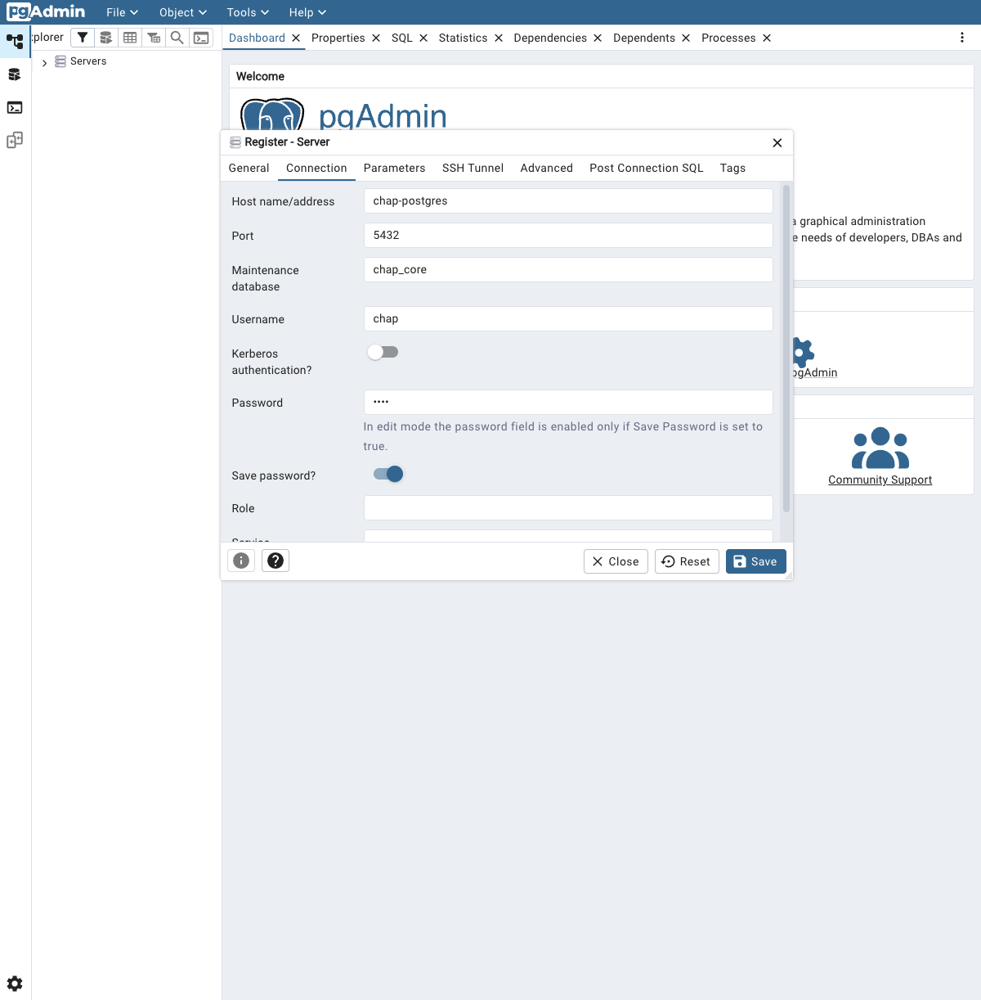
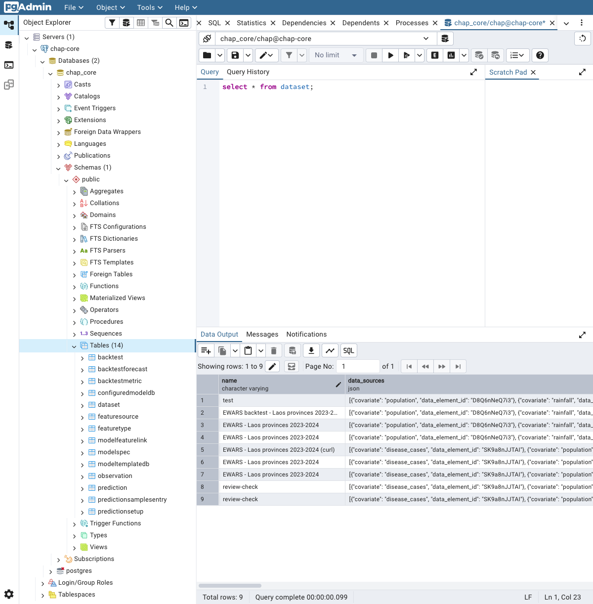

# Inspecting the database

Two PostgreSQL databases sit behind the stack: **chap-core's** (models, runs, and the data
they used) and **DHIS2's** (all DHIS2 metadata and data). The APIs are usually the better way
in, but raw SQL is handy for digging into a run or answering a question the API does not.

| Database | Service | Host port | DB name | User / password |
|----------|---------|-----------|---------|-----------------|
| chap-core | `chap-postgres` | `15433` | `chap_core` | `chap` / `chap` |
| DHIS2 | `dhis2-db` | `15432` | `dhis` | `dhis` / `dhis` |

Both are bound to `127.0.0.1` (the bundled stack; ports are overridable with `CHAP_DB_PORT` /
`DHIS2_DB_PORT`).

## Connecting

### A. Into the container (no host tools needed)

Open a `psql` prompt inside the database container - works even if you have no SQL client
installed:

```bash
# chap database
docker compose -f compose.chap.yml exec chap-postgres psql -U chap -d chap_core
# DHIS2 database
docker compose -f compose.chap.yml exec dhis2-db psql -U dhis -d dhis
```

At the prompt, `\dt` lists tables and `\q` quits. Run a one-off query without the prompt by
adding `-c "<sql>"`.

### B. From the host (psql or a GUI)

The databases are published on `127.0.0.1`, so a local client can connect directly:

```bash
psql -h 127.0.0.1 -p 15433 -U chap chap_core   # chap   (password: chap)
psql -h 127.0.0.1 -p 15432 -U dhis dhis         # DHIS2  (password: dhis)
```

Or point a GUI such as DBeaver or pgAdmin at host `127.0.0.1` and those ports.

### C. pgAdmin (a web GUI)

If you prefer clicking to typing, run **pgAdmin** - a web UI for Postgres - on the stack's
network so it can reach the databases by service name:

```bash
docker run -d --name dac-pgadmin --network docker-dhis2-core_default -p 5050:80 \
  -e PGADMIN_DEFAULT_EMAIL=admin@example.com \
  -e PGADMIN_DEFAULT_PASSWORD=admin \
  -e PGADMIN_CONFIG_SERVER_MODE=False \
  dpage/pgadmin4
```

Open [http://localhost:5050](http://localhost:5050), set a master password when prompted, then
**Add New Server**. On the **Connection** tab use the service name as the host (pgAdmin is on
the same Docker network):

| Field | chap | DHIS2 |
|-------|------|-------|
| Host name/address | `chap-postgres` | `dhis2-db` |
| Port | `5432` | `5432` |
| Maintenance database | `chap_core` | `dhis` |
| Username / Password | `chap` / `chap` | `dhis` / `dhis` |



Once connected, open **Tools -> Query Tool** to run SQL (below), or expand the tree to
**Databases -> chap_core -> Schemas -> public -> Tables** and right-click a table ->
**View/Edit Data** to browse it without writing any SQL.



Stop pgAdmin when you are done with `docker rm -f dac-pgadmin`.

## What's in the chap database

```bash
docker compose -f compose.chap.yml exec chap-postgres psql -U chap -d chap_core -c '\dt'
```

The tables that matter most:

- `backtest`, `backtestforecast` - evaluations and their predicted values
- `prediction`, `predictionsamplesentry` - forecasts and their samples
- `dataset`, `observation` - the data a run used
- `configuredmodeldb`, `modeltemplatedb` - the models and templates

A few example queries (add them to the `exec … -c "…"` form, or run them at a `psql` prompt):

```sql
-- the evaluations you have run
select id, name, model_id from backtest order by id;

-- your forecasts and how far ahead they go
select id, name, model_id, n_periods from prediction order by id;

-- how much data is stored, and how many forecast rows
select count(*) from observation;
select count(*) from backtestforecast;

-- the configured models
select id, name from configuredmodeldb order by id;
```

Most of this is on the chap API too (`/v1/crud/backtests`, …), so reach for SQL when you need a
join or an aggregate the API does not give you.

## The DHIS2 database

Same idea on port `15432`. DHIS2's schema is large and the **API is almost always the better
tool** for DHIS2 data - it enforces permissions and returns clean JSON. Use SQL for low-level
checks:

```bash
docker compose -f compose.chap.yml exec dhis2-db psql -U dhis -d dhis \
  -c "select count(*) from organisationunit;"
```

## Dump and restore

A `pg_dump` snapshot is your safety net - most importantly **before a chap-core update**, which
may migrate the database. Take one first and you can roll back if the upgrade misbehaves.

**Back up** the chap database to a file on your machine (custom, compressed format):

```bash
docker compose -f compose.chap.yml exec -T chap-postgres \
  pg_dump -U chap -Fc chap_core > chap_core.dump
```

**Restore** it - this replaces the current contents (`--clean` drops the existing objects
first):

```bash
cat chap_core.dump | docker compose -f compose.chap.yml exec -T chap-postgres \
  pg_restore -U chap -d chap_core --clean --if-exists
```

The DHIS2 database is the same idea with `dhis2-db` and `-U dhis dhis`. In **pgAdmin** the same
lives under **Tools -> Backup…** and **Tools -> Restore…**.

!!! tip "Before you upgrade chap-core"
    Dump first, then upgrade. If a new version's migration fails - or you simply want the old
    data back - restore the dump. The upgrade guide (next) covers switching versions itself.

!!! warning "Read, don't write"
    These are the live databases. Inspect freely with `SELECT`s, but do not hand-edit rows -
    changes bypass the application logic and can corrupt a run or your DHIS2 instance. To start
    clean instead, recreate the stack: `docker compose -f compose.chap.yml down -v`.

!!! note "Assignment: look inside chap"
    - [ ] Open a `psql` prompt in the chap database and run `\dt`.
    - [ ] List your `backtest`s and `count(*)` the `observation`s.

## What's next

You can read the logs and the data behind a run. The last operational topic is **upgrading and
restoring chap** - moving between versions without losing (or while deliberately resetting)
that data.
